# Modular Breadboard Holder System

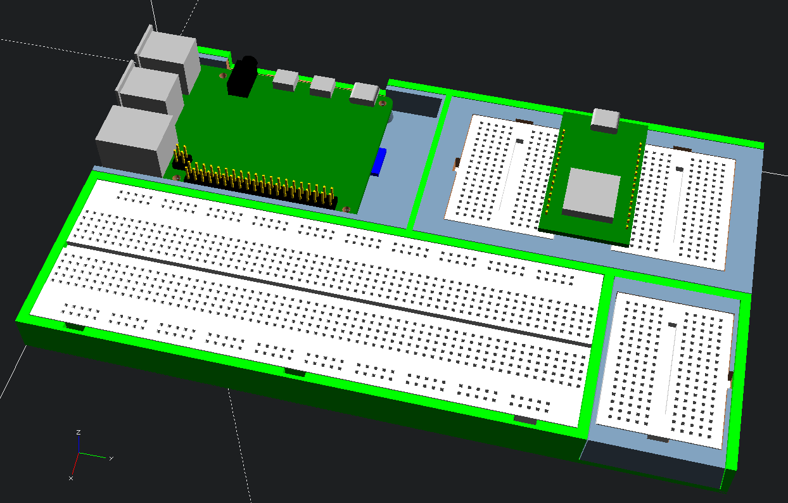

## The Modules Frame

This is a modular breadboard holder system. It consists of a frame holding a full-sized breadboard and three slots, two larger and one smaller slot.

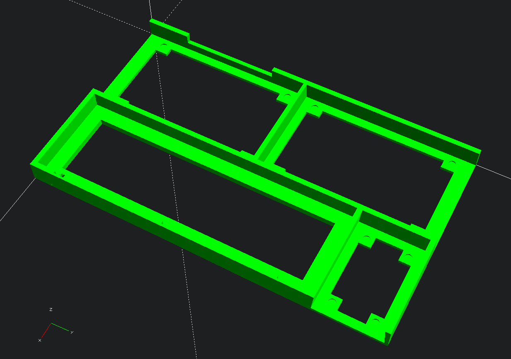

Each slot can hold various kind of modules e.g. for mini computers, microcontrollers, further breadboards, or simple trays. You can configure it in the way you like.

## The Modules

There are several modules available for

* Raspberry Pi Model B (like 3, 4, or 5)

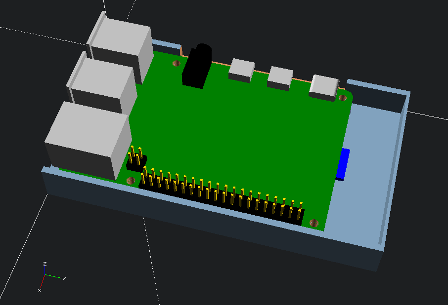

* Raspberry Pi Zero

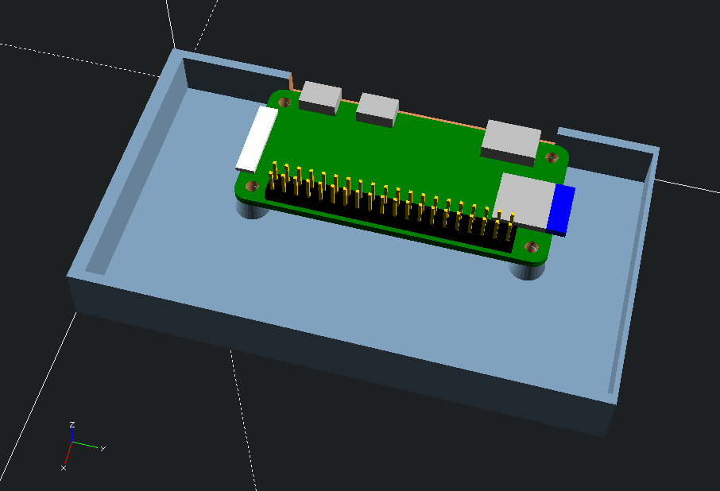

* several Arduino boards like UNO, MEGA2560, and compatible

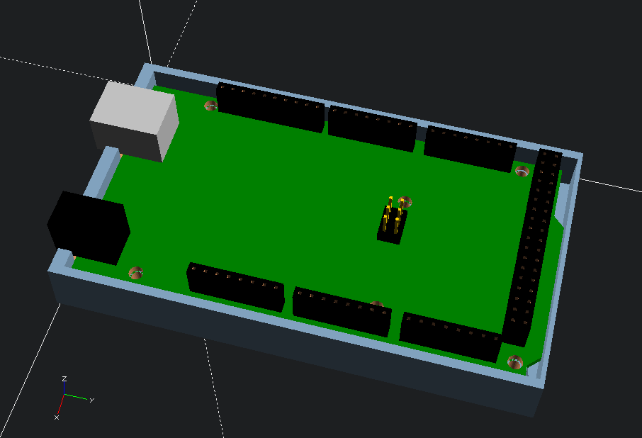

* Microcontrollers like ESP8286, ESP32, etc. Two mini breadboards are placed just as far away from each other that a wider microcontroller board like a ESP32 Dev Kit fits in between them.

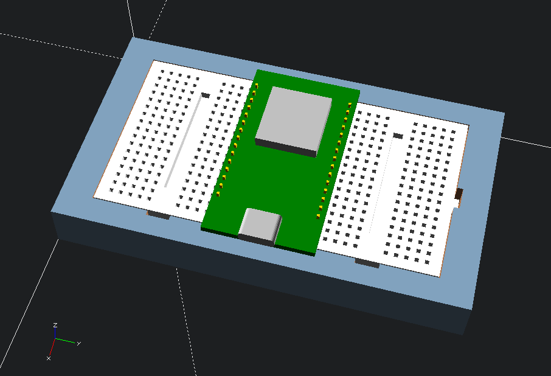

* Half-sized and mini breadboards

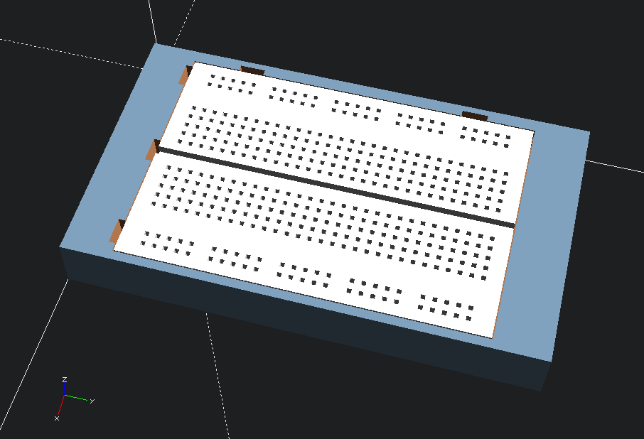
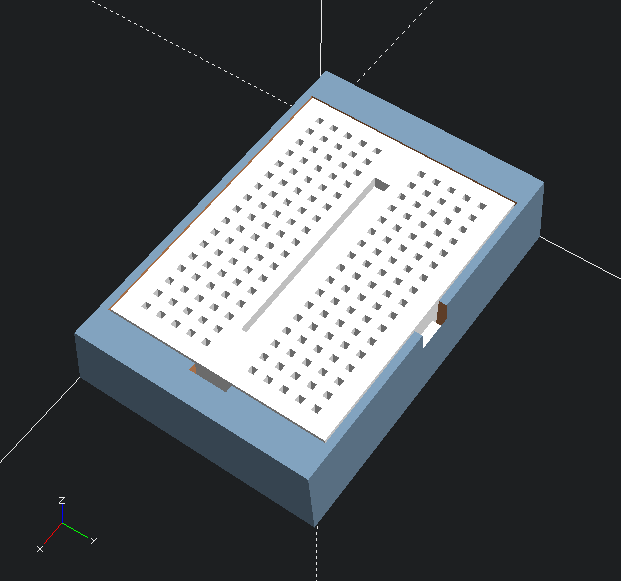

* And simple trays for stuff, like resistors, LEDs, transistors or whatever you like.

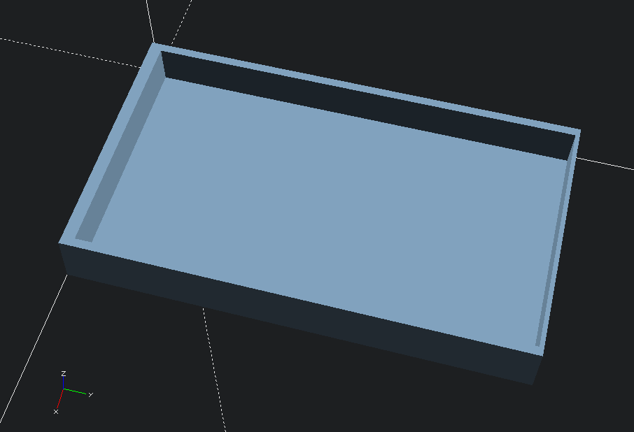
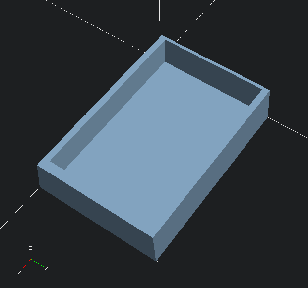

The modules are easily exchangable, hold in position by small round magnets of 4 mm diameter and 1 mm thickness. The modules snap into their position. The larger modules except the one for Raspberry Pis can be either used on the left or right side.

## The Base

There is also a base that fits under the modules frame. It has space for jumper wires that are well organized in a comb-like structure, as well as two smaller trays. Like the modules magnets hold the base in place.

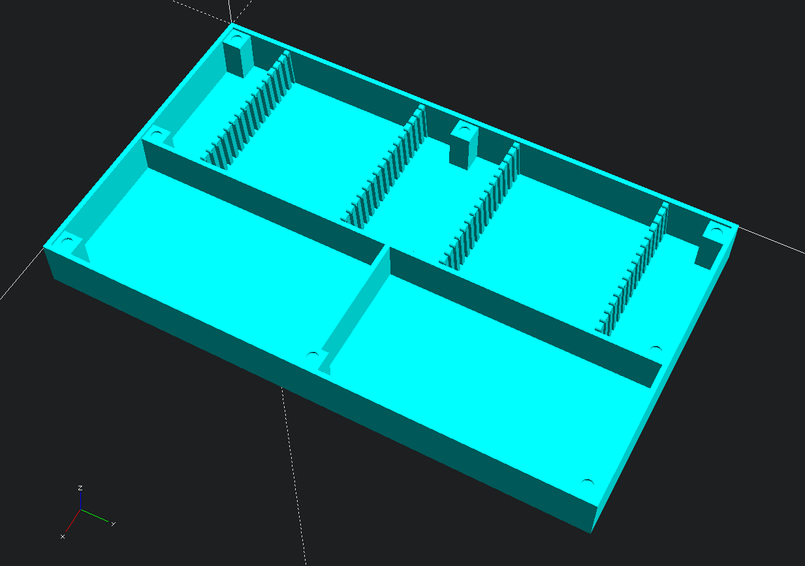

## License

This repository is distributed under the [CC BY-NC-SA 4.0](https://creativecommons.org/licenses/by-nc-sa/4.0/) license.

